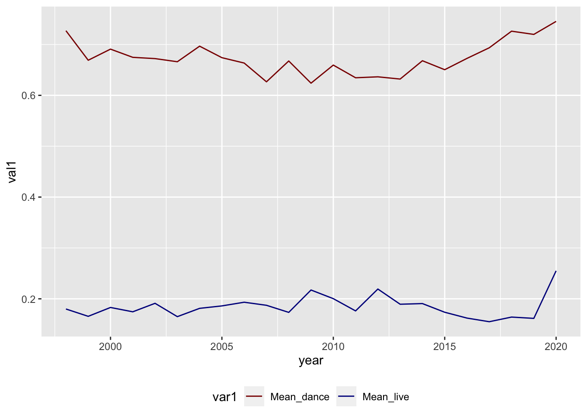

::: {.cell}

:::

## Exercise 1

### Question 1

::: {.cell}

:::

The dataset contains:  
- 1926 different songs (1879 different titles)  
- 835 different artists  
- 59 different genres.

### Question 2

::: {.cell}
::: {.cell-output-display}
| year| Nb artists|
|----:|----------:|
| 1998|          1|
| 1999|         30|
| 2000|         58|
| 2001|         77|
| 2002|         56|
| 2003|         64|
| 2004|         65|
| 2005|         69|
| 2006|         63|
| 2007|         66|
| 2008|         63|
| 2009|         61|
| 2010|         62|
| 2011|         69|
| 2012|         67|
| 2013|         64|
| 2014|         70|
| 2015|         68|
| 2016|         74|
| 2017|         86|
| 2018|         81|
| 2019|         73|
| 2020|          3|
:::
:::

### Question 3

::: {.cell}

:::

The most popular artist is Rihanna with 23 songs.

### Question 4

::: {.cell}
::: {.cell-output-display}
|genre                                 |  min  |  max  | mean  | median | number |
|:-------------------------------------|:-----:|:-----:|:-----:|:------:|:------:|
|Dance/Electronic                      | 75.3  | 179.6 | 125.5 | 126.0  |   41   |
|Folk/Acoustic, pop                    | 94.9  | 128.9 | 111.9 | 111.9  |   2    |
|Folk/Acoustic, rock                   | 84.2  | 84.2  | 84.2  |  84.2  |   1    |
|Folk/Acoustic, rock, pop              | 138.6 | 138.6 | 138.6 | 138.6  |   1    |
|R&B                                   | 71.8  | 170.7 | 106.9 | 100.5  |   13   |
|World/Traditional, Folk/Acoustic      | 82.8  | 82.8  | 82.8  |  82.8  |   1    |
|World/Traditional, hip hop            | 98.1  | 102.0 | 100.0 | 100.0  |   2    |
|World/Traditional, pop                | 108.1 | 108.1 | 108.1 | 108.1  |   1    |
|World/Traditional, pop, Folk/Acoustic | 100.4 | 104.8 | 102.6 | 102.6  |   2    |
|World/Traditional, rock               | 96.0  | 140.1 | 118.0 | 118.0  |   2    |
|World/Traditional, rock, pop          | 132.0 | 139.0 | 135.5 | 135.5  |   2    |
|country                               | 103.1 | 205.6 | 138.2 | 136.0  |   9    |
|country, latin                        | 96.1  | 96.1  | 96.1  |  96.1  |   1    |
|easy listening                        | 157.9 | 157.9 | 157.9 | 157.9  |   1    |
|hip hop                               | 64.9  | 180.0 | 117.0 | 111.7  |  120   |
|hip hop, Dance/Electronic             | 95.9  | 190.2 | 135.4 | 131.1  |   15   |
|hip hop, R&B                          | 100.2 | 151.2 | 121.1 | 112.0  |   3    |
|hip hop, country                      | 98.0  | 98.0  | 98.0  |  98.0  |   1    |
|hip hop, latin, Dance/Electronic      | 172.0 | 172.0 | 172.0 | 172.0  |   1    |
|hip hop, pop                          | 73.0  | 203.9 | 119.0 | 120.0  |  265   |
|hip hop, pop, Dance/Electronic        | 72.0  | 196.1 | 120.9 | 126.1  |   75   |
|hip hop, pop, R&B                     | 60.0  | 203.9 | 115.2 | 107.2  |  234   |
|hip hop, pop, R&B, Dance/Electronic   | 82.8  | 127.9 | 103.9 | 101.0  |   3    |
|hip hop, pop, R&B, latin              | 82.3  | 100.0 | 91.2  |  91.2  |   2    |
|hip hop, pop, country                 | 129.4 | 129.4 | 129.4 | 129.4  |   1    |
|hip hop, pop, latin                   | 89.7  | 180.2 | 127.2 | 127.0  |   14   |
|hip hop, pop, rock                    | 84.9  | 180.0 | 123.1 | 125.2  |   9    |
|hip hop, rock, pop                    | 90.1  | 90.1  | 90.1  |  90.1  |   1    |
|latin                                 | 90.0  | 198.1 | 121.6 |  97.1  |   15   |
|metal                                 | 79.0  | 147.4 | 106.2 | 102.0  |   9    |
|pop                                   | 65.0  | 195.7 | 120.6 | 120.0  |  411   |
|pop, Dance/Electronic                 | 84.9  | 198.1 | 123.7 | 124.1  |  213   |
|pop, Folk/Acoustic                    | 76.0  | 171.8 | 118.4 | 110.0  |   8    |
|pop, R&B                              | 68.9  | 210.9 | 117.0 | 112.0  |  170   |
|pop, R&B, Dance/Electronic            | 84.0  | 176.1 | 112.0 | 104.1  |   6    |
|pop, R&B, easy listening              | 109.0 | 109.0 | 109.0 | 109.0  |   1    |
|pop, country                          | 97.9  | 147.9 | 130.5 | 136.9  |   8    |
|pop, easy listening, Dance/Electronic | 135.1 | 135.1 | 135.1 | 135.1  |   1    |
|pop, easy listening, jazz             | 82.2  | 127.8 | 105.0 | 105.0  |   2    |
|pop, latin                            | 80.0  | 177.8 | 113.6 | 104.3  |   28   |
|pop, rock                             | 78.0  | 176.7 | 121.1 | 119.0  |   26   |
|pop, rock, Dance/Electronic           | 87.0  | 189.9 | 134.0 | 136.0  |   12   |
|pop, rock, Folk/Acoustic              | 103.0 | 113.0 | 108.0 | 108.0  |   2    |
|pop, rock, metal                      | 83.0  | 155.8 | 128.9 | 134.7  |   14   |
|rock                                  | 75.0  | 199.9 | 129.5 | 123.7  |   57   |
|rock, Dance/Electronic                | 128.0 | 128.0 | 128.0 | 128.0  |   1    |
|rock, Folk/Acoustic, easy listening   | 123.0 | 123.0 | 123.0 | 123.0  |   1    |
|rock, Folk/Acoustic, pop              | 80.5  | 80.5  | 80.5  |  80.5  |   1    |
|rock, R&B, Folk/Acoustic, pop         | 106.0 | 106.0 | 106.0 | 106.0  |   1    |
|rock, blues                           | 123.9 | 141.9 | 132.9 | 132.9  |   2    |
|rock, blues, latin                    | 97.9  | 128.0 | 112.9 | 112.9  |   2    |
|rock, classical                       | 81.7  | 81.7  | 81.7  |  81.7  |   1    |
|rock, easy listening                  | 115.0 | 115.0 | 115.0 | 115.0  |   1    |
|rock, metal                           | 89.3  | 188.0 | 127.4 | 120.1  |   36   |
|rock, pop                             | 69.0  | 184.1 | 123.9 | 125.0  |   39   |
|rock, pop, Dance/Electronic           | 113.0 | 182.0 | 135.8 | 127.4  |   8    |
|rock, pop, metal                      | 126.1 | 152.0 | 140.3 | 141.5  |   4    |
|rock, pop, metal, Dance/Electronic    | 105.0 | 105.0 | 105.0 | 105.0  |   1    |
|set()                                 | 68.5  | 184.8 | 120.1 | 127.0  |   22   |
:::
:::

### Question 5

::: {.cell}
::: {.cell-output-display}
| year| Mean_live| Mean_dance|
|----:|---------:|----------:|
| 1998|     0.180|      0.727|
| 1999|     0.166|      0.669|
| 2000|     0.183|      0.691|
| 2001|     0.175|      0.675|
| 2002|     0.191|      0.672|
| 2003|     0.165|      0.666|
| 2004|     0.181|      0.697|
| 2005|     0.186|      0.674|
| 2006|     0.193|      0.663|
| 2007|     0.187|      0.627|
| 2008|     0.173|      0.668|
| 2009|     0.217|      0.624|
| 2010|     0.200|      0.659|
| 2011|     0.176|      0.635|
| 2012|     0.219|      0.636|
| 2013|     0.189|      0.632|
| 2014|     0.191|      0.668|
| 2015|     0.174|      0.650|
| 2016|     0.162|      0.673|
| 2017|     0.155|      0.693|
| 2018|     0.164|      0.726|
| 2019|     0.162|      0.720|
| 2020|     0.255|      0.745|
:::
:::

### Question 6

::: {.cell}
::: {.cell-output-display}
{width=672}
:::
:::

## Exercice 2

::: {.cell}

:::

### Question 1

::: {.cell}
::: {.cell-output-display}
|Target   |Marital status    | medianAG|
|:--------|:-----------------|--------:|
|Dropout  |single            |   123.35|
|Dropout  |married           |   126.50|
|Dropout  |divorced          |   126.50|
|Dropout  |widower           |   129.40|
|Dropout  |facto union       |   119.40|
|Dropout  |legally separated |   112.50|
|Graduate |single            |   127.30|
|Graduate |married           |   130.00|
|Graduate |divorced          |   126.00|
|Graduate |widower           |   170.00|
|Graduate |facto union       |   120.00|
|Graduate |legally separated |   114.80|
|Enrolled |single            |   124.05|
|Enrolled |married           |   122.95|
|Enrolled |divorced          |   130.20|
|Enrolled |widower           |   151.75|
|Enrolled |facto union       |   119.70|
|Enrolled |legally separated |   119.00|
:::
:::

### Question 2

::: {.cell}
::: {.cell-output-display}
|Marital status    | Dropout | Graduate | Enrolled |
|:-----------------|:-------:|:--------:|:--------:|
|single            | 123.35  |  127.3   |  124.05  |
|married           | 126.50  |  130.0   |  122.95  |
|divorced          | 126.50  |  126.0   |  130.20  |
|widower           | 129.40  |  170.0   |  151.75  |
|facto union       | 119.40  |  120.0   |  119.70  |
|legally separated | 112.50  |  114.8   |  119.00  |
:::
:::

### Question 3

::: {.cell}
::: {.cell-output-display}
|Gender | Curricular units 1st sem (credited)| Curricular units 1st sem (enrolled)| Curricular units 1st sem (evaluations)| Curricular units 1st sem (approved)| Curricular units 1st sem (grade)| Curricular units 1st sem (without evaluations)| Curricular units 2nd sem (credited)| Curricular units 2nd sem (enrolled)| Curricular units 2nd sem (evaluations)| Curricular units 2nd sem (approved)| Curricular units 2nd sem (grade)| Curricular units 2nd sem (without evaluations)|
|:------|-----------------------------------:|-----------------------------------:|--------------------------------------:|-----------------------------------:|--------------------------------:|----------------------------------------------:|-----------------------------------:|-----------------------------------:|--------------------------------------:|-----------------------------------:|--------------------------------:|----------------------------------------------:|
|Male   |                                   0|                                   6|                                      8|                                   4|                         11.83333|                                              0|                                   0|                                   6|                                      8|                                   4|                         11.63604|                                              0|
|Female |                                   0|                                   6|                                      8|                                   6|                         12.50000|                                              0|                                   0|                                   6|                                      8|                                   5|                         12.50000|                                              0|
:::
:::

### Question 4

::: {.cell}
::: {.cell-output-display}
|Units                                          | Male | Female |
|:----------------------------------------------|:----:|:------:|
|Curricular units 1st sem (credited)            | 0.0  |  0.0   |
|Curricular units 1st sem (enrolled)            | 6.0  |  6.0   |
|Curricular units 1st sem (evaluations)         | 8.0  |  8.0   |
|Curricular units 1st sem (approved)            | 4.0  |  6.0   |
|Curricular units 1st sem (grade)               | 11.8 |  12.5  |
|Curricular units 1st sem (without evaluations) | 0.0  |  0.0   |
|Curricular units 2nd sem (credited)            | 0.0  |  0.0   |
|Curricular units 2nd sem (enrolled)            | 6.0  |  6.0   |
|Curricular units 2nd sem (evaluations)         | 8.0  |  8.0   |
|Curricular units 2nd sem (approved)            | 4.0  |  5.0   |
|Curricular units 2nd sem (grade)               | 11.6 |  12.5  |
|Curricular units 2nd sem (without evaluations) | 0.0  |  0.0   |
:::
:::
